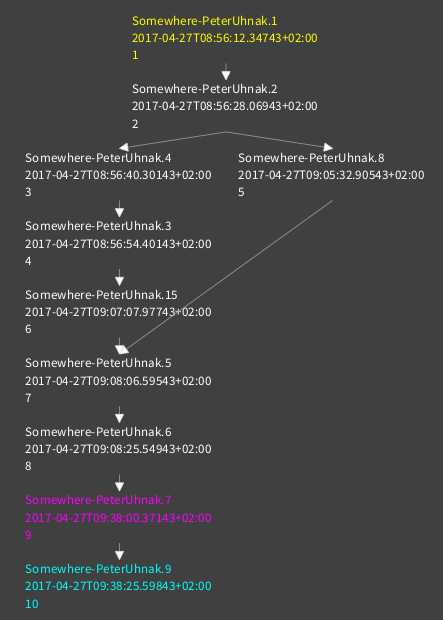
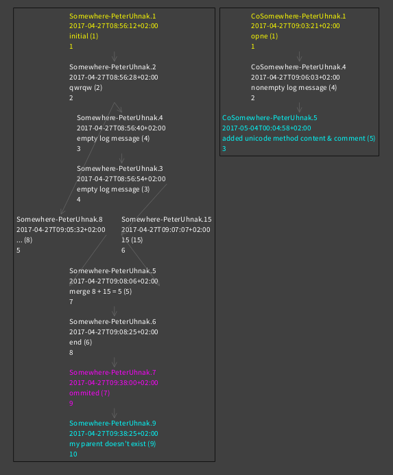

# MCZ -> Git Migration
[](https://travis-ci.org/peteruhnak/git-migration) [](https://coveralls.io/github/peteruhnak/git-migration?branch=master)

Utility to migrate code from SmalltalkHub (or any MCZ-based repo) to Git

## Possible Issues

This migration is by no means complete, and the following problems could be encountered:

* performance - this is a big problem for big repos, as every commit does heavy IO operations on disk, I'm looking on ways to improve it
* relying on dependencies specified in Versions
	* these days dependencies are specified in ConfigurationOf/BaselineOf, but old approach relied on some other way (which I don't even know how to use), I am ignoring this to improve perfomance, but I am not sure if it is safe
* OSSubProcess/ProcessWrapper freezing/crashing
	* this could potentially require restart of the whole migration, but it should be mostly fine
* Merges are not converted to git merges
	* This doesn't impact the functionality of the code, it just obscures the history somewhat
		* On the other hand you cannot easily see this information in MCZ without writing your own visualization
	* Maybe fixed in the future

## Usage

### Example

```smalltalk
migration := GitMigration on: 'peteruhnak/breaking-mcz'.
migration authors: {'PeterUhnak' -> #('Peter Uhnak' '<i.uhnak@gmail.com>')}.
migration migrateToGitFileTreeRepositoryNamed: 'breaking-mcz/repository'
```

### Prerequsites:

* git installed in the system
* installed and working GitFileTree (available in catalog)

### 1. Adding Repositories

Add your source repository (SmalltalkHub) and your target repository (local gitfiletree://) to Pharo, e.g. via Monticello Browser

### 2. Running Migration


```smalltalk
"Specify the name of the source repository; I am sourcing from peteruhnak/breaking-mcz project on SmalltalkHub"
migration := GitMigration on: 'peteruhnak/breaking-mcz'.

"List all authors anywhere in the project's commits"
migration allAuthors. "#('PeterUhnak')"

"You must specify name and email for _every_ author"
"AuthorName (as shown in #allAuthors) -> #('Nicer Name' '<email.including-brackets@example.com>')"
migration authors: {'PeterUhnak' -> #('Peter Uhnak' '<i.uhnak@gmail.com>')}.

"Run the migration, this might take a while
The target repository is found by string-matching so here the repo is in the folder 'breaking-mcz' and subfolder 'repository'"
migration migrateToGitFileTreeRepositoryNamed: 'breaking-mcz/repository'
```

## Git Tips

Forgetting all changes in the history and going back to previous state. (Useful if the migration is botched and you want to rollback all changes.)

```bash
git reset --hard SHA
```

## Extras

If you want to play around with the data before commiting, read the following.

```smalltalk
migration := GitMigration on: 'peteruhnak/breaking-mcz'.
```

Downloading all MCZs from server; this needs to happen only once and can take a while for large repos.
```smalltalk
migration cacheAllVersions.
```

List all packages in the repository that have multiple roots; although rare, this could be either result of multiple people starting independently on the same package, or a mistake was made during committing.
GitMigration should be able to handle this correctly regardless.
```smalltalk
migration packagesWithMultipleRoots.
```

List all authors in the repository.
```smalltalk
migration allAuthors.
```

Dictionary of all packages and their _real_ (see later what's real) commits.
```smalltalk
versionsByPackage := migration versionsByPackage.
```

*All* versions of a package, whether there is actually an MCZ or not. With Monticello it is very easy to create a commit whose ancestor is not in the repository, so it is not obvious how the commit connects the previous ones.
Thankfully MCZ typically contains the hierarchy many steps back, so we can correctly reconstruct the whole tree.
```smalltalk
allVersions := migration completeAncestryOfPackageNamed: 'Somewhere'.
```

The versions in mcz are random, so we need to sort them in an order in which we can commit them to git. This means that all ancestry is honored (no child is commited before its parent), and "sibling" commits are sorted by date.
Note that we cannot just sort the commits by date, because the date might not follow the ancestry correctly (which can happen, so I cannot rely on it)
```smalltalk
sorted := migration topologicallySort: allVersions.
```

Get the total ordering of all commits across all packages
```smalltalk
sorted := migration topologicallySort: allVersions.
```

## Visualizations

This requires Roassal to be installed (available in catalog)

In all visualizations hovering over an item will show a popup with more information, and clicking on item will open an inspector.
Keep in mind that running the command will not open a new window, so you have to either inspect it, or do-it-and-go in playground.

### Single Package Ancestry

Looking at raw data is not very insightful, so couple visualization are included:

Show the complete ancestry of a single package.
```smalltalk
migration := GitMigration on: 'peteruhnak/breaking-mcz'.
migration showAncestryTopologyOnPackageNamed: 'Somewhere'.
```



* Red - root versions (versions with no parents, typically only a single initial commit)
* Blue - tail/head versions (versions with no children, typically the latest version(s))
* Purple - "virtual" versions that do not have a corresponding commit (this happens as mentioned earlier)

The number on the third line indicates in what order the packages will be commited (purple packages are listed, but are not commited, because there is no code to commit)
Keep in mind that the number in the commit (Somewhere-PeterUhnak.15) has no value, and can be easily changed (and broken by hand); `breaking-mcz` project was intentionally constructed to have the numbers semi-random to demonstrate this.


### Project Ancestry

To see all packages and history, you could do.

```smalltalk
migration showProjectAncestry.
```


This is useful if you want to quickly glance at a project (and is also much faster to generate and use), but if want you can also add label

```smalltalk
migration showProjectAncestryWithLabels.
"or"
migration showProjectAncestryWithLabels: true.
```




### Limited Project Ancestry

If you have big project and want to look only at certain packages, you can do so. (In the image you can see that the longest chain has ancestry broken - red box at the end)

```
migration := GitMigration on: 'PolyMath/PolyMath'.
"or just a collection of package names"
migration showProjectAncestryOn: (allPackages copyWithoutAll: #('Monticello' 'ConfigurationOfSciSmalltalk'  'Math-RealInterval')).
```


Adding labels works the same way

```
migration showProjectAncestryOn: aCollectionOfPackages withLabels: aBoolean
```


## Installation

```st
Metacello new
	baseline: 'GitMigration';
	repository: 'github://peteruhnak/git-migration/repository';
	load.
```